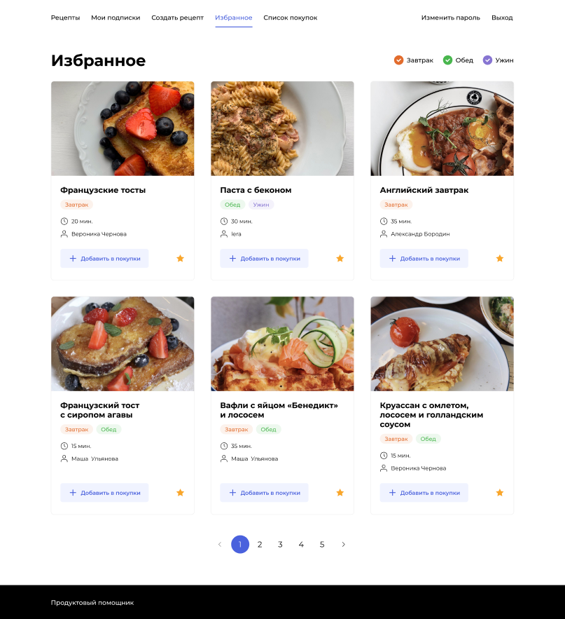

# Pet-Project (django)
 

## О проекте

Продуктовый помощник - это площадка, на которой возможно делиться рецептами со всем миром, обмениваться знаниями о кулинарии, сохранять и добавлять в избранное, а так же возможно скачивать список необходимых ингредиентов на ужин ;)
Ip: 158.160.30.159
Домен: luckyfirst.zapto.org

## Используемые фремворки

Бэкенд проекта был написан на языке Python с использованием фреймворка Django. Фронтдент написан на React. Для поддержания, распределения и развертывания сайта использовались: Docker, Nginx и библиотека Gunicorn.

### Запуск проекта

1. Скопируйте проект на свой компьютер 
    git clone https://github.com/LicrimoVor/foodgram-project-react.git
2. Создайте образы и запустите контейнеры
    cd infra/
    docker compose up
3. Наслаждайтесь )

## Authors

* **Иван Кудьяров** - *Студент площадки Yandex Practicum* - [Иван Кудьяров](https://github.com/LicrimoVor) - *Написал backend*

## Дополнительные возможности

1. Импорт ингредиентов
    python manage.py import_db -m ingredient -r /data/ingredients.csv
